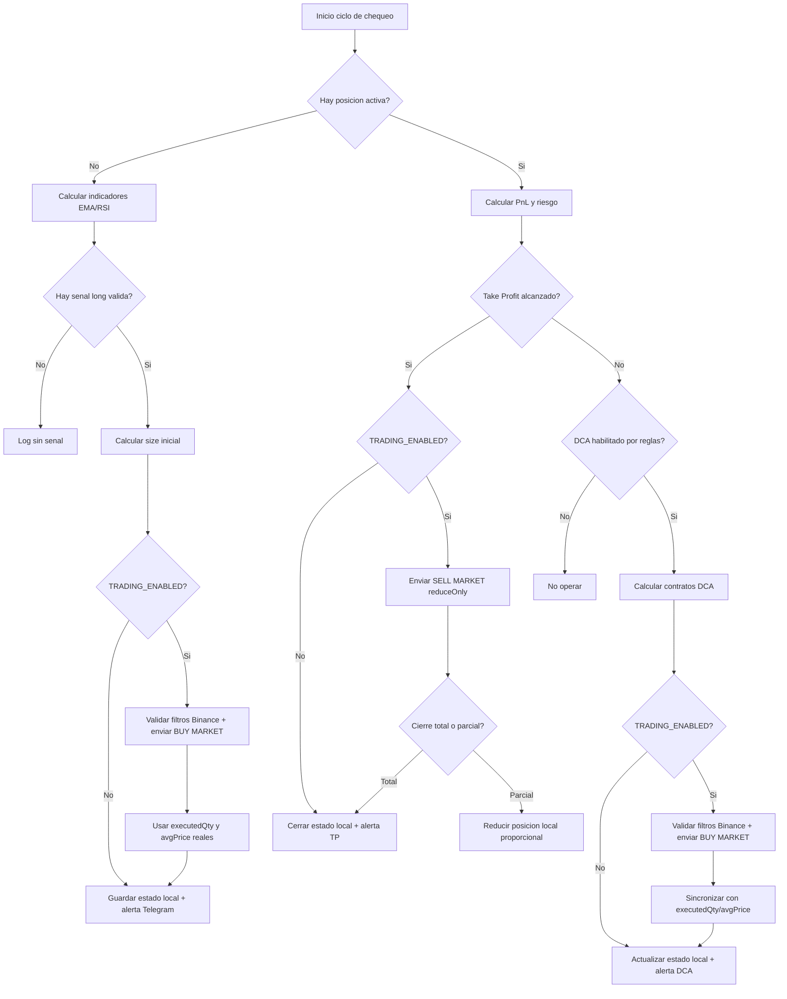
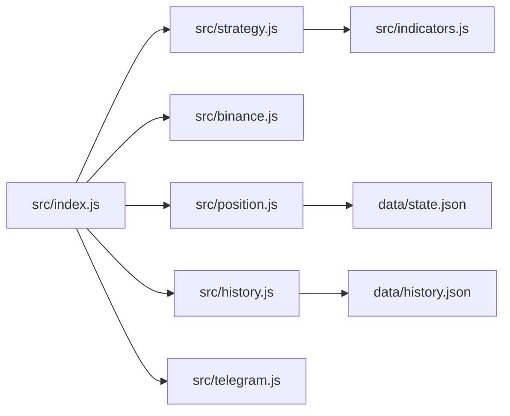

# Crypto Alert Bot Bull

Bot de estrategia long para Binance COIN-M Futures (DAPI), con alertas por Telegram y opcion de ejecutar ordenes reales.

## 1) Que hace este bot

- Monitorea un simbolo fijo: `BTCUSD_PERP`.
- Evalua senal de entrada long con EMA + RSI.
- Maneja posicion con DCA por reglas de perdida.
- Cierra por Take Profit.
- Envia alertas y resumen diario por Telegram.
- Puede operar en modo:
  - Solo alertas (`TRADING_ENABLED=false`)
  - Trading real (`TRADING_ENABLED=true`)

## 2) Estrategia (explicada simple)

### Entrada long

El bot abre una posicion long cuando detecta pullback:

- RSI en umbral de entrada (mercado mas "descansado").
- Precio en zona de EMA (sin perseguir subidas fuertes).
- Fuerza de senal valida (`medium` o `strong`).

### DCA (recargas)

Si ya hay posicion y el precio baja:

- Calcula perdida actual (considerando leverage).
- Aplica reglas de DCA por tramos de perdida.
- Limita recarga diaria.
- Intenta recargar en mejor momento usando RSI 1h.
- Si pasa la hora fallback, puede recargar igual.

### Take Profit

- Si el precio sube lo suficiente (segun `takeProfitPercent`), activa cierre.
- En modo real envia `SELL MARKET` con `reduceOnly`.

### Riesgo de liquidacion

- Estima precio de liquidacion por leverage.
- Si la distancia es baja, envia alerta de riesgo.

## 3) Diagrama de flujo de estrategia



## 4) Arquitectura rapida



## 5) Trading real: como funciona por dentro

Cuando `TRADING_ENABLED=true`:

1. Valida que existan `BINANCE_API_KEY` y `BINANCE_API_SECRET`.
2. Carga filtros del simbolo (`minQty`, `maxQty`, `stepSize`).
3. Antes de cada orden MARKET:
   - Ajusta cantidad al `stepSize`.
   - Respeta `maxQty`.
   - Bloquea si queda debajo de `minQty`.
4. Envia orden firmada a Binance DAPI.
5. Sincroniza estado local con datos reales de ejecucion:
   - `executedQty`
   - `avgPrice`
6. Si TP cierra parcial, mantiene posicion remanente en estado local.

## 6) Variables de entorno (.env)

Ejemplo minimo:

```dotenv
TELEGRAM_BOT_TOKEN=tu_token
TELEGRAM_CHAT_ID=123456789,987654321

BINANCE_API_KEY=tu_api_key
BINANCE_API_SECRET=tu_api_secret

TRADING_ENABLED=false
```

Notas:

- `TRADING_ENABLED=false`: modo seguro (solo alertas).
- `TRADING_ENABLED=true`: habilita envio de ordenes reales.

## 7) Configuracion de estrategia

Archivo: `config.js`

Ajustes principales:

- `symbol` (fijo: `BTCUSD_PERP`)
- `leverage`
- `capitalBTC`
- `totalParts` / `initialParts`
- `dcaRules`
- `takeProfitPercent`
- `liquidationAlertPercent`
- `checkCron` / `dailySummaryCron`

## 8) Instalacion y uso

Requisitos:

- Node.js 20+

Pasos:

```bash
npm install
npm start
```

El bot ejecuta:

- chequeo periodico de mercado
- resumen diario
- logs en consola
- estado persistente en `data/state.json`
- historial en `data/history.json`

## 9) Seguridad recomendada

- No compartas `.env`.
- Usa API key de Binance sin permisos de retiro.
- Empeza con `TRADING_ENABLED=false` y valida comportamiento.
- Luego activa real con size pequeno y monitoreo.

## 10) Limitaciones

- No hay garantia absoluta de ejecucion perfecta (latencia, cambios de exchange, mantenimiento).
- El bot minimiza rechazos por filtros, pero Binance puede rechazar por otros motivos externos.
